# **iStruktura**
### Video Demo: https://youtu.be/wOYjRWwPF0c
### Description
**iStruktura** is a web app where Civil/Structural Engineers and Civil Engineering students can use to design structural members including but not limited to Singly-Reinforced Beam, Doubly-Reinforced Beam, Column and Isolated Footing.
### Why I Developed This App
As a Structural Engineer(in the Philippines) myself, I am aware that the common practice of Structural Engineers in designing structural members is to use different excel/MathCad design templates to design different structural members and then just 'Save As' the templates in the project folder. In my experience, this is very inefficient because you would have a lot of design tempalate files in the project folder.
<br>
<br>
Also, with using just excel design templates, it can get difficult to keep track which files are the updated version, because some engineers click 'Save' instead of 'Save As' when creating new designs, which overrides the existing design.
<br>
<br>
So I developed the **iStruktura** app as a one stop app for engineers to perform and save their structural designs online, which can be accessed in any device the user uses.

### Technologies Used
+ **Python (Flask)** - Backend
+ **Flask-WTF** (Flask extension which is a thin wrapper arount the WTForms package) - handle the web forms
+ **Flask-SQLAlchemy** (Flask extension that provides a Flask-friendly wrapper to the popular SQLAlchemy package) - Database
+ **Flask-Migrate** (Flask extension which is a wrapper for Alembic, a database migration framework for SQLAlchemy) - Database Migration
+ **Flask-Login** (Flask extension that manages the user logged-in state)
+ **HTML**
+ **CSS**
+ **JavaScript**

### iStruktura App Features
+ **Login / Register** - Once a user has created an account, they will have access to a wide variety of structural design tools
<br>
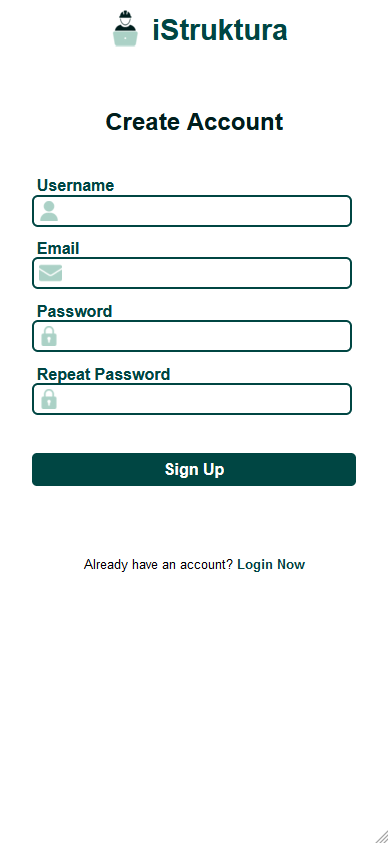
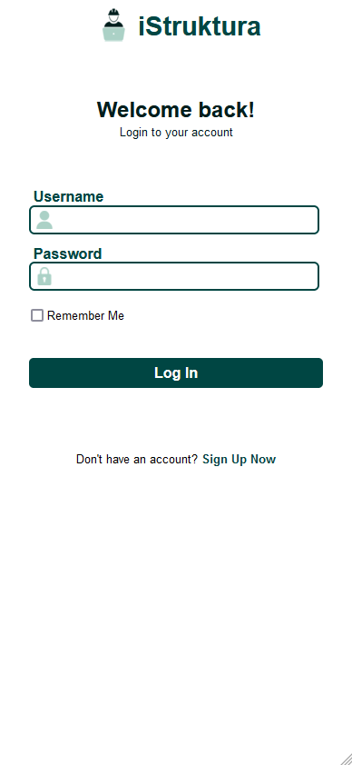
<br>
<br>
+ In the **Dashboard** tab, the user can access the recent files they saved
<br>
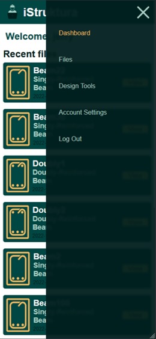
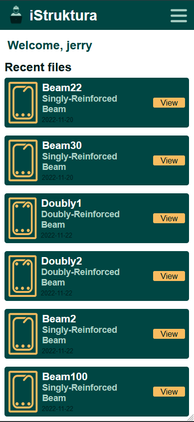
<br>
<br>
+ In the **Account Settings** tab, the user can edit the Username, Email and About Me
<br>
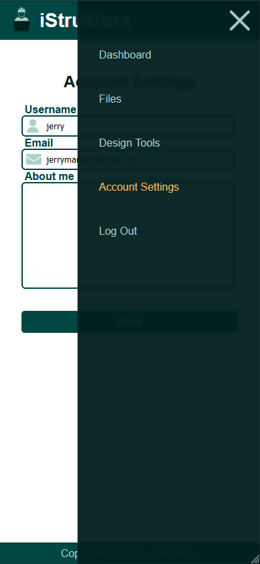
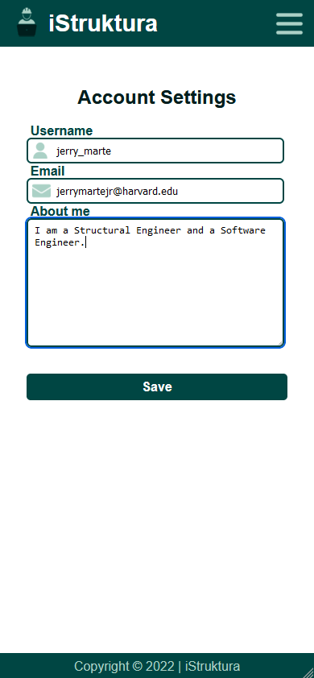
<br>
<br>
+ In the **Files** tab, the user can access all the files they saved sorted by date saved. The user can view or delete the files in this tab
<br>
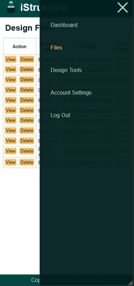

<br>
<br>
+ In the **Design Tools** tab, the user can access all the design tools for differenct structural members
<br>
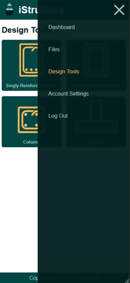
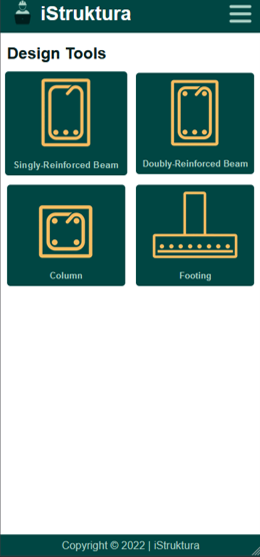
<br>
<br>
+ To demonstrate the function of the design tools, I'll be using the **Singly-Reinforced Beam** tool
  + This design tool required the user to input the design data, some of the design data are already have input based on the usual values, but the user can change this if needed. The **Design Result Summary** section is still empty, this is where the summary of the design result will be shown when the user clicks 'Design'
  <br>
  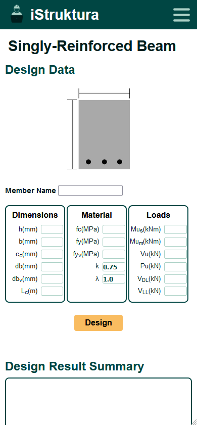
  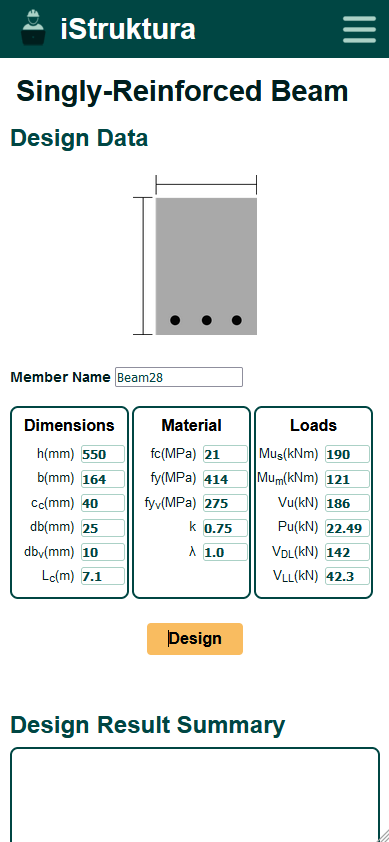
  <br>
  <br>
  + When the user clicks 'Design', the result will be shown in the **Design Result Summary** section. When the user is unsatisfied with the result, they can change some of the design data and click 'Redesign'. When the user is satisfied with the result, the user can 'Save' the file.
  <br>
  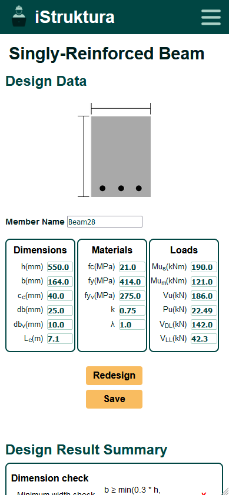
  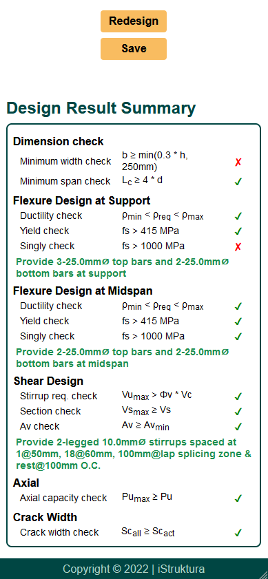
  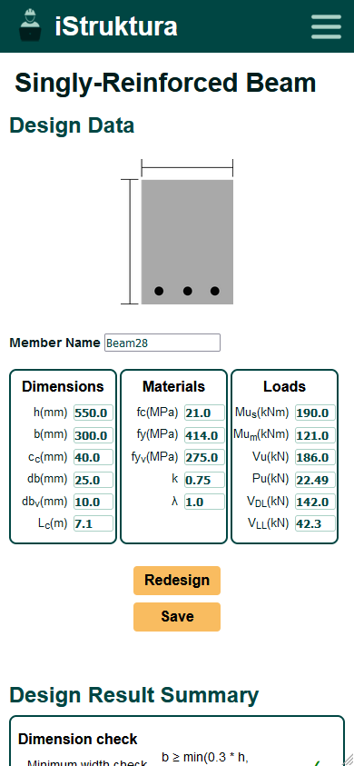
  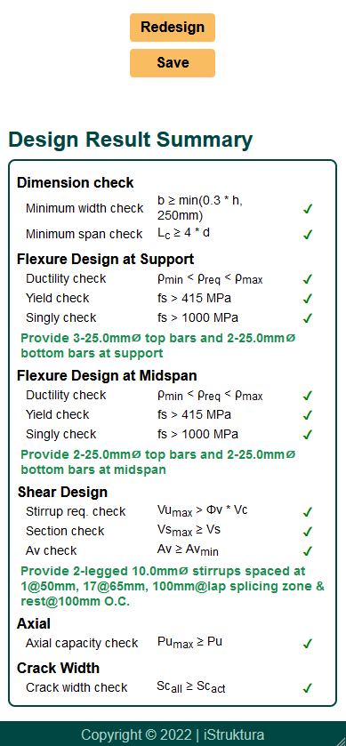
<br>
<br>
+ When the user saves the file, they will be saved in the Files tab.
<br>
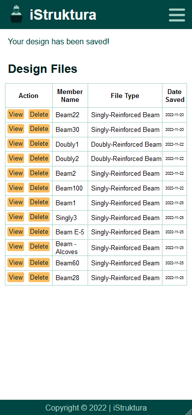
<br>
<br>
+ When the user views one of the files, the **Design Data** and **Design Result Summary** of the file will be shown. The user can click 'View Detailed Report' to view, save or print the detailed structural report as PDF
<br>
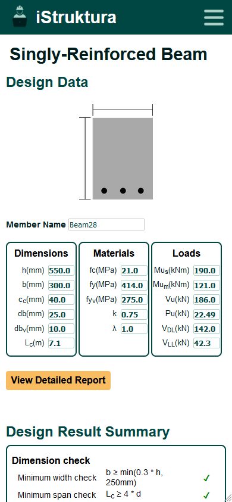
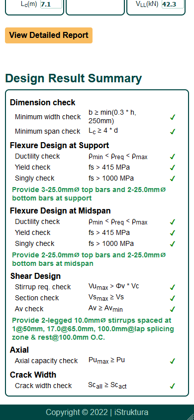
<br>
<br>
+ When the user clicks 'View Detailed Report', the user will be redirected to the PDF file of the detailed structural report
<br>
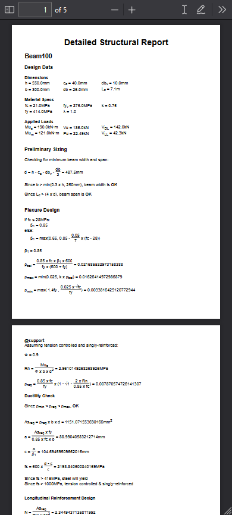

### Main Files
+ **app** folder - package that will host the application
+ app/**__init.py__** - script that creates the application object as an instance of class **Flask**
+ app/**routes.py** - contains all the view functions
+ app/**templates** - contains all the html files
+ app/**static** - contains all the CSS, Javascript and media files
+ app/**forms.py** - contains all the web form classes
+ app/**models.py** - contains all the database models (database table)
+ **migrations** folder - contains all the version and details of the database migrations
+ **istruktura.py** - script at the top-level that defines the Flask application instance
+ **config.py** - contains the configuration settings that are defined as class variables inside the **Config** class

### Installation
1. Make sure Python is installed in your machine
2. Clone the repository to your machine
3. Create a python virtual environment (optional)
4. Install the requirements with the following command: 
```
pip install -r requirements.txt
```
5. Run the app with the following command: 
```
flask run
```


